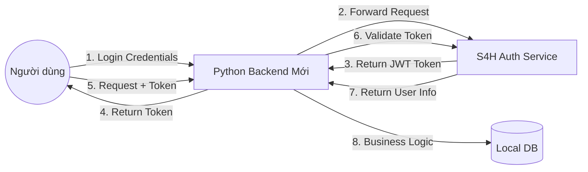

# 📑 TÀI LIỆU GIẢI PHÁP TÍCH HỢP HỆ THỐNG XÁC THỰC (S4H AUTH INTEGRATION)

**Phiên bản:** 1.0
**Ngày lập:** 29/01/2026
**Phạm vi:** Backend Python (New System) & S4H Auth Service (Identity Provider)

---

## 1. Tổng quan giải pháp (Executive Summary)

Dự án Backend mới (Python) sẽ **không xây dựng module quản lý tài khoản** (đăng ký, đăng nhập, lưu mật khẩu). Thay vào đó, hệ thống sẽ sử dụng **S4H Auth Service** làm nhà cung cấp định danh trung tâm (Identity Provider - IDP).

Mô hình áp dụng là **Proxy Authentication Pattern**:

1. **S4H Auth:** Chịu trách nhiệm xác thực (Authentication) - Kiểm tra "Bạn là ai?".
2. **Python Backend:** Chịu trách nhiệm ủy quyền (Authorization) & Nghiệp vụ - Kiểm tra "Bạn được làm gì trong hệ thống mới?".

---

## 2. Kiến trúc luồng dữ liệu (System Architecture)

Sơ đồ khái niệm về cách hai hệ thống giao tiếp:

### Các thành phần chính:

* **Identity Provider (S4H Auth):** Nơi duy nhất chứa bảng `Users` gốc (Email, Password hash, Profile cơ bản).
* **Resource Server (Python Backend):** Hệ thống mới, chứa dữ liệu nghiệp vụ riêng, tin tưởng tuyệt đối vào Token do S4H cấp.

---

## 3. Đặc tả API Đối tác (S4H Reference)

Dưới đây là danh sách các Endpoint của hệ thống S4H mà Backend Python cần giao tiếp.
**Base URL:** `http://api-auth.aisteamx.edu.vn`

### 3.1. Nhóm Xác thực (Auth Core)

| Chức năng | Method | Endpoint | Input (Body) | Output (Success) |
| --- | --- | --- | --- | --- |
| **Đăng nhập** | `POST` | `/auth/login` | `{ "email": "...", "password": "..." }` | `{ "accessToken": "...", "refreshToken": "..." }` |
| **Đăng ký** | `POST` | `/auth/register` | `{ "email": "...", "password": "...", "firstName": "...", "lastName": "..." }` | `200 OK` |
| **Làm mới Token** | `POST` | `/auth/refresh` | `{ "refreshToken": "..." }` | `{ "accessToken": "..." }` |

### 3.2. Nhóm Thông tin (User Info)

| Chức năng | Method | Endpoint | Yêu cầu Header | Mục đích |
| --- | --- | --- | --- | --- |
| **Lấy Profile** | `GET` | `/users/me` | `Authorization: Bearer <token>` | Dùng để xác thực Token có hợp lệ không và lấy `user_id` để định danh. |

---

## 4. Quy trình nghiệp vụ chi tiết (Workflows)

Đây là hướng dẫn logic (logic flow) để lập trình viên cài đặt vào Backend Python.

### 4.1. Quy trình Đăng nhập (Login Flow)

*Mục tiêu: Người dùng nhập mail/pass ở App mới nhưng được xác thực bởi Server cũ.*

1. **Client** gửi `email` và `password` lên **Python Backend**.
2. **Python Backend** nhận dữ liệu, giữ kết nối, và gọi API `/auth/login` sang **S4H Auth**.
3. **Xử lý kết quả:**
* *Nếu S4H trả về 200 (Thành công):* Python Backend nhận chuỗi JWT Token, trả nguyên văn về cho Client.
* *Nếu S4H trả về 400/401 (Thất bại):* Python Backend trả lỗi "Sai tài khoản hoặc mật khẩu" về cho Client.
* *Lưu ý:* Backend Python **TUYỆT ĐỐI KHÔNG** lưu lại mật khẩu của user vào log hay database.

### 4.2. Quy trình Xác thực Request (Authentication Middleware)

*Mục tiêu: Bảo vệ các API nghiệp vụ của hệ thống mới (ví dụ: tạo đơn hàng, viết bài).*

Mọi Request gửi vào các API bảo mật của Python Backend bắt buộc phải có Header: `Authorization: Bearer <access_token>`.

**Các bước xử lý tại Middleware:**

1. **Bắt Token:** Lấy chuỗi token từ Header.
2. **Kiểm tra nóng (Token Introspection):**
* Python Backend gọi ngay API `GET /users/me` sang S4H Auth với token đó.

3. **Phân nhánh kết quả:**
* **Trường hợp A (Token Hợp lệ - 200 OK):**
* S4H trả về thông tin user (gồm `id`, `email`, `role`).
* Python Backend dùng `id` này để tìm user tương ứng trong Database nội bộ (Xem mục 5).
* Cho phép request đi tiếp vào xử lý nghiệp vụ.

* **Trường hợp B (Token Hết hạn/Sai - 401 Unauthorized):**
* Từ chối request ngay lập tức. Yêu cầu Client thực hiện quy trình Refresh Token.

### 4.3. Quy trình Đồng bộ User (User Sync Strategy)

*Vấn đề: Hệ thống mới cần lưu dữ liệu riêng (ví dụ: điểm số, lịch sử) cho user, nên cần có một bảng user nội bộ.*

Sử dụng chiến lược **"Lazy Sync"** (Đồng bộ khi cần):

* Khi Middleware xác thực thành công (ở bước 4.2), Python Backend sẽ kiểm tra trong Database nội bộ:
* *Query:* "Có user nào trong bảng `LocalUser` có `external_id` bằng với `id` vừa nhận từ S4H không?"
* *Nếu chưa có:* Tự động `INSERT` một bản ghi mới với `external_id` và `email` lấy từ S4H.
* *Nếu đã có:* Cập nhật lại `email` (nếu có thay đổi) và tiếp tục.

---

## 5. Thiết kế Cơ sở dữ liệu (Database Schema)

Để tích hợp, Database của hệ thống Python cần thiết kế bảng User như sau:

**Tên bảng gợi ý:** `local_users` (hoặc `accounts`)

| Tên trường | Kiểu dữ liệu | Ràng buộc | Giải thích |
| --- | --- | --- | --- |
| `id` | Integer / UUID | **Primary Key** | ID nội bộ của hệ thống mới (dùng để join bảng khác). |
| `s4h_user_id` | String / UUID | **Unique, Index** | **QUAN TRỌNG:** Chứa ID nhận được từ S4H. Đây là cầu nối giữa 2 hệ thống. |
| `email` | String |  | Lưu để gửi mail thông báo từ hệ thống mới. |
| `role_system_new` | String |  | Phân quyền riêng cho hệ thống mới (VD: Editor, Premium User). |
| `created_at` | DateTime |  | Ngày user bắt đầu dùng hệ thống mới. |

**Lưu ý:**

* Không có cột `password`.
* Không có cột `password_salt`.
* Bảng này chỉ chứa metadata để link dữ liệu.

---

## 6. Chính sách & Bảo mật (Security Policy)

Để đảm bảo an toàn khi tích hợp hệ thống bên ngoài:

1. **Zero Trust Password:** Backend Python hoạt động như một "Proxy" trong quá trình đăng nhập. Password chỉ đi qua RAM, không bao giờ được ghi xuống ổ cứng (File Log, DB).
2. **Token Caching (Tùy chọn nâng cao):** Để tránh việc gọi API `/users/me` quá nhiều lần (gây chậm), có thể cache kết quả xác thực user vào Redis trong thời gian ngắn (ví dụ: 5 phút).
3. **Xử lý lỗi hệ thống:** Nếu S4H Auth bị sập (Downtime), hệ thống mới phải có cơ chế thông báo lỗi thân thiện ("Hệ thống đăng nhập đang bảo trì"), thay vì văng lỗi code (Internal Server Error).
4. **CORS:** Nếu Frontend và Backend Python nằm khác domain, nhớ cấu hình CORS cho phép Header `Authorization`.

---

